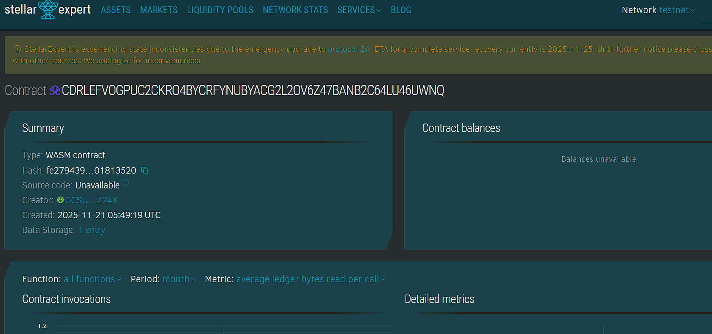

## Project Title
TutorSession Seal

## Project Description
TutorSession Seal timestamps and verifies tutoring session completions and payments. A session record stores tutor and student addresses, ledger timestamp, duration in minutes and two flags indicating confirmation and payment status.

## Project Vision
The vision is to provide an auditable, tamper resistant record of tutoring deliveries so students and tutors have a clear on chain proof of sessions and automated payment triggers.

## Key Features
Record a tutoring session with tutor, student and duration. Student confirms the session to mark it valid. An on chain payout representation can be released to the tutor based on a rate per minute. Tutors withdraw their accumulated balances from the contract.

## Future Scope
Integrate with a token standard to perform actual token transfers on payout. Add evidence hashes, session recordings and multi signature approval for institutions. Add dispute resolution flows and batch payouts.

## Contract Details
Contract ID: CDRLEFVOGPUC2CKRO4BYCRFYNUBYACG2L2OV6Z47BANB2C64LU46UWNQ
